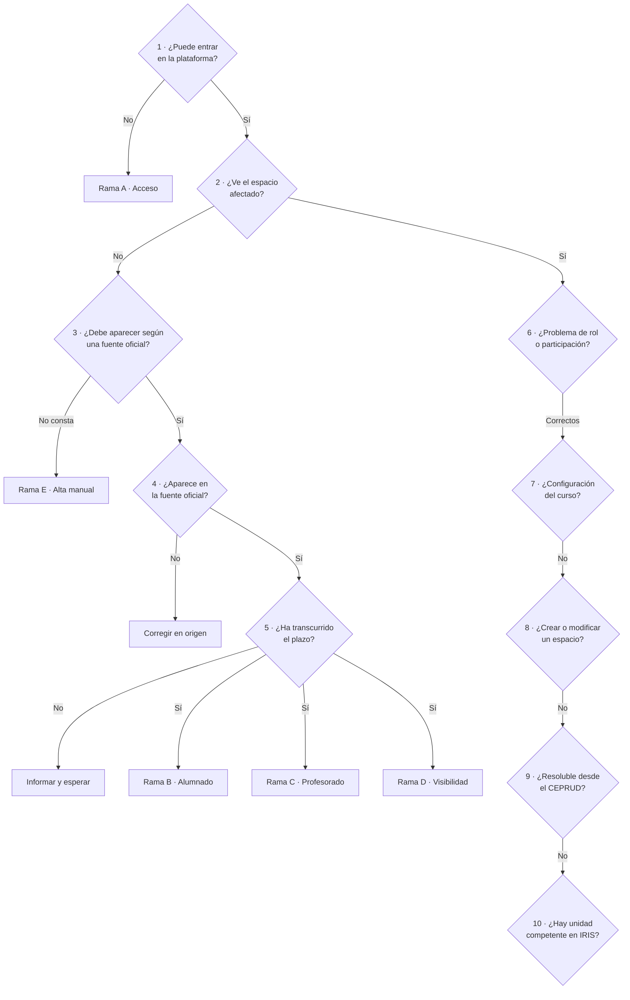

# Árbol general de decisión para incidencias de PRADO

> **Naturaleza de este documento.** Es una **síntesis operativa** elaborada a partir de
> las reglas, categorías y procedimientos de esta base de conocimiento. La documentación
> interna indica que el árbol anterior está desactualizado, de modo que esta versión
> **debe validarse institucionalmente** antes de considerarla definitiva.

## Punto de partida

Antes de utilizar el árbol, registrar:

- plataforma;
- curso académico;
- identidad y correo de la persona;
- condición de alumnado, docente, coordinación o usuario externo;
- nombre y código del espacio;
- mensaje de error o comportamiento observado.

## Esquema



## 1. ¿La persona puede entrar en la plataforma?

- **No** → [Rama A — Problemas de acceso](/prado/arquitectura-y-procesos/rama-a-problemas-de-acceso.md)
- **Sí** → pregunta 2.

## 2. ¿La persona ve el espacio o curso afectado?

- **No** → pregunta 3.
- **Sí** → pregunta 6.

## 3. ¿La persona debe aparecer según una fuente oficial?

| Condición | Qué comprobar | Dónde |
|---|---|---|
| Es estudiante | Matrícula oficial, curso académico, grupo, incidencia administrativa y plataforma | Grado: Oficina Virtual y [vistas de bases de datos](/prado/conceptos-y-reglas/vistas-bases-datos.md). Posgrado: solo vistas |
| Es docente | [POD](/prado/conceptos-y-reglas/plan-ordenacion-docente.md), asignatura, grupo, créditos, plataforma y curso académico | Vistas de bases de datos |
| Es coordinación | Registro institucional de la coordinación, tipo de espacio de gestión y rol esperado | Vistas de bases de datos |
| No consta en ninguna fuente | — | → [Rama E — Solicitudes de alta manual](/prado/arquitectura-y-procesos/rama-e-solicitudes-alta-manual.md) |

## 4. ¿La persona aparece en la fuente oficial?

### No

**La causa no está en PRADO.**

1. Indicar qué unidad debe corregir el dato.
2. No realizar un alta manual como sustitución permanente.
3. Clasificar como [Matrícula](/prado/iris/matricula.md) u
   [Ordenación docente](/prado/iris/ordenacion-docente.md), según el dato afectado.

### Sí

Pasar a la pregunta 5.

## 5. ¿Ha transcurrido el plazo normal de actualización?

Los plazos vigentes están en
[Parámetros operativos de PRADO](/prado/parametros-operativos.md).

### No

1. Informar del plazo.
2. Registrar la fecha del cambio.
3. Esperar a la ejecución del automatismo.
4. **No duplicar la participación manualmente.**

### Sí

Comprobar altas automáticas, estado suspendido o no activo, cuenta duplicada, código y
grupo, visibilidad, plataforma y curso académico. Después, continuar en la rama que
corresponda:

- [Rama B — El alumnado no ve un curso](/prado/arquitectura-y-procesos/rama-b-alumnado-no-ve-curso.md)
- [Rama C — El profesorado no ve una asignatura](/prado/arquitectura-y-procesos/rama-c-profesorado-no-ve-asignatura.md)
- [Rama D — Espacio oculto o problema de visibilidad](/prado/arquitectura-y-procesos/rama-d-visibilidad.md)

## 6. ¿El problema afecta al rol o a la participación?

| Situación | Qué comprobar | Clasificación habitual |
|---|---|---|
| Rol incorrecto o doble rol | Rol actual, rol esperado, participaciones duplicadas, tipo de espacio y fuente que justifica el rol | [Usuario/rol duplicado](/prado/iris/usuario-rol-duplicado.md), [Gestión manual](/prado/iris/gestion-manual.md) u [Ordenación docente](/prado/iris/ordenacion-docente.md) |
| [Participación suspendida](/prado/usuarios-y-roles/participacion-suspendida.md) | Si la persona ha dejado de llegar desde la fuente oficial | [Baja de usuario](/prado/iris/baja-usuario.md) |
| [Participación no activa](/prado/usuarios-y-roles/participacion-no-activa.md) | Si fue incorporada manualmente al margen de las bases de datos | [Gestión manual](/prado/iris/gestion-manual.md) |
| El rol y la participación son correctos | — | → pregunta 7 |

## 7. ¿El problema está relacionado con la configuración del curso?

### Sí

Clasificar según el caso: [Visibilidad](/prado/iris/visibilidad.md),
[LMS: Calificaciones](/prado/iris/lms-calificaciones.md),
[LMS: Cuestionarios](/prado/iris/lms-cuestionarios.md),
[LMS: Copias .mbz](/prado/iris/lms-copias-mbz.md),
[LMS: Mensajería y foros](/prado/iris/lms-mensajeria-y-foros.md),
[LMS: Turnitin](/prado/iris/lms-turnitin.md),
[LMS: Uso general](/prado/iris/lms-uso-general.md) u otra categoría LMS disponible.

### No

Pasar a la pregunta 8.

## 8. ¿Se solicita crear o modificar un espacio docente?

### Sí

Comprobar tipo de espacio, requisitos de creación, código, responsables, participantes
automáticos, autorización y limitaciones aplicables.

- [Tipos de espacios docentes de PRADO](/prado/espacios-docentes/index.md)
- [IRIS: Espacios docentes](/prado/iris/espacios-docentes.md)

### No

Pasar a la pregunta 9.

## 9. ¿La incidencia puede resolverse desde el CEPRUD?

### Sí

Aplicar el procedimiento correspondiente y documentar la fuente consultada, el resultado,
la actuación y la respuesta facilitada.

### No

Pasar a la pregunta 10.

## 10. ¿Existe una unidad competente disponible en IRIS?

### Sí

Valorar la transferencia **únicamente después** de realizar las comprobaciones.

- [Transferencia de tickets en IRIS](/prado/conceptos-y-reglas/transferencia-tickets-iris.md)

### No

1. Informar a la persona de la unidad con la que debe contactar.
2. Dejar constancia de la comprobación.
3. Cerrar el ticket cuando proceda.

## Ramas

| Rama | Cuándo se entra |
|---|---|
| [Rama A — Problemas de acceso](/prado/arquitectura-y-procesos/rama-a-problemas-de-acceso.md) | No consigue entrar en la plataforma |
| [Rama B — El alumnado no ve un curso](/prado/arquitectura-y-procesos/rama-b-alumnado-no-ve-curso.md) | Estudiante que entra pero no ve una asignatura |
| [Rama C — El profesorado no ve una asignatura](/prado/arquitectura-y-procesos/rama-c-profesorado-no-ve-asignatura.md) | Docente que entra pero no ve su docencia |
| [Rama D — Espacio oculto o visibilidad](/prado/arquitectura-y-procesos/rama-d-visibilidad.md) | Está incorporada pero no ve el espacio |
| [Rama E — Solicitudes de alta manual](/prado/arquitectura-y-procesos/rama-e-solicitudes-alta-manual.md) | No consta en ninguna fuente oficial |

## Resultado final

Toda rama debe terminar en una de estas decisiones:

```text
Resolver técnicamente
Informar y esperar actualización
Solicitar corrección administrativa
Realizar actuación manual autorizada
Transferir a la unidad competente
Cerrar con información y comprobaciones documentadas
```

## Registro mínimo del ticket

Antes del cierre o la transferencia, dejar anotado:

- plataforma;
- curso académico;
- persona y correo;
- espacio y código;
- fuente consultada;
- dato encontrado;
- plazo comprobado;
- categoría de IRIS;
- actuación realizada;
- resultado final.

## Documentos relacionados

- [Flujo general de resolución de incidencias de PRADO](/prado/arquitectura-y-procesos/flujo-general-resolucion-incidencias.md)
- [Temas de ayuda de IRIS](/prado/temas-de-ayuda/index.md)
- [Parámetros operativos de PRADO](/prado/parametros-operativos.md)
